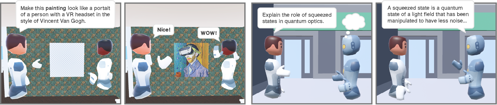

# Welcome to Ubiq-Genie

Ubiq-Genie is a framework that enables you to build server-assisted collaborative mixed reality applications with Unity using the [Ubiq](https://ubiq.online) framework. This is particularly useful for building multi-user applications that require server-side processing such as generative models, conversational agents, and real-time transcription. For more information, please refer to the [Ubiq-Genie paper](https://ubiq.online/publication/ubiq-genie/).

> [!NOTE]
> Before starting with Ubiq-Genie, we recommend that you familiarize yourself with the Ubiq framework. For more information, see Ubiq's [documentation](https://ucl-vr.github.io/ubiq/) and [website](https://ubiq.online). Ubiq-Genie currently uses Ubiq [v1.0.0-pre.16](https://github.com/UCL-VR/ubiq/releases/tag/unity-v1.0.0-pre.16).

## Initial Setup

These instructions will get you a copy of the project up and running to run the samples and to start building your own applications. Ubiq-Genie supports Windows, macOS, and Linux. Ubiq-Genie has a server-client architecture, which means you may need to run the server on a separate machine from the Unity client.

### Server (Node.js)

0. Install [Node.js](https://nodejs.org/en/download/) (v20 or later) and [Python](https://www.python.org/downloads/) (v3.10 or later).

1. Clone this repository somewhere on your machine (either local or remote).

2. Open a terminal in the `Node` folder and run `npm install` to install the dependencies.

3. Install the Python dependencies by navigating to the `Node/services` folder and running `pip install -r requirements.txt`. If you are using a virtual environment, activate it before running the command. Please ensure that you have the correct PyTorch and CUDA versions installed (see the [PyTorch website](https://pytorch.org/get-started/locally/) for more information).

### Client (Unity)

1. Install [Unity](https://unity3d.com/get-unity/download) **6.0 LTS** (version currently used is *Unity 6000.0.63f1*).

2. Clone this repository somewhere on your local machine.

3. Add the `Unity` folder to Unity Hub and open the project in Unity.

4. Navigate to Package Manager, click the Ubiq package (com.ucl.ubiq), navigate to the "Samples" tab, and import the "Demo (XRI)" sample. This will add the Unity XR Interaction Toolkit package to the project, as well as some scripts used by the Ubiq-Genie sample applications.

> [!NOTE]
> Read the README file in the corresponding folder in the `Node/apps` folder for further setup instructions. For a list of available samples, see the [Samples](#samples) section below.

## Documentation

For more information on how to use Ubiq-Genie, please refer to the README files in the `Node` folder.

## Samples

The `Node/apps` folder contains a number of samples that demonstrate how to use Ubiq-Genie, which each utilize one or more services defined in the `Node/services` folder. For more information on how to use these samples, please refer to the README files in the corresponding folders. Currently, the following collaborative sample applications are available:

- [**Texture Generation**](Node/apps/texture_generation/README.md): generates a texture based on voice-based input and an optional ray to select target objects
- [**Multi-user Conversational Agent**](Node/apps/conversational_agent/README.md): a conversational agent that can be interacted with by multiple users
- [**Transcription**](Node/apps/transcription/README.md): transcribes and audio of each user in the room in separate files

For a demo video of the samples, please refer to the [Ubiq-Genie demo video](https://youtu.be/cGz0z9BIgQk).

## Support

For any questions, please use the Discussions tab on GitHub or send a message in the *ubiq-genie* channel in the [Ubiq Discord server](https://discord.gg/cZYzdcxAAB). For bug reports, please use the Issues tab on GitHub.
